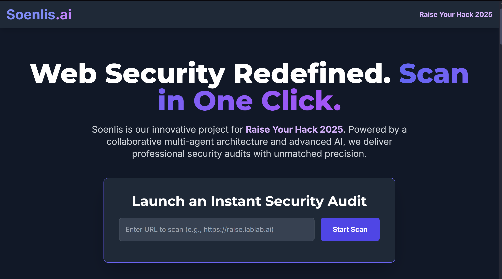
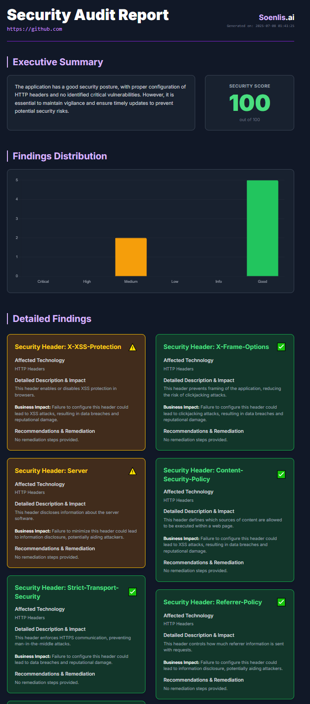

# Soenlis.ai: Intelligent Web Security Scanner

## 🚀 Ignite Your Vision. Build the Future.

**Soenlis.ai** is an intelligent web security scanner developed for the **Raise Your Hack 2025** hackathon. It leverages a cutting-edge **multi-agent architecture** powered by **Coral Protocol** and advanced AI models (Llama 3.1, Groq) to provide comprehensive and precise security audits for web applications.

Soenlis redefines web security by offering **automated, ethical, and blazing-fast vulnerability detection** in a single click.

---

## ✨ Key Features

- **AI-Powered Vulnerability Detection** Utilizes advanced models (Llama 3.1, Groq) to identify and analyze vulnerabilities with high precision.

- **Multi-Agent Orchestration (Coral Protocol)** Modular agents (Orchestrator, Reconnaissance, CVE Auditor, Report Generator) collaborate in real-time.

- **Blazing Fast Scans (Groq Integration)** Groq API ensures ultra-low latency and rapid analysis.

- **Automated HTML Reporting** Professional, user-friendly reports with actionable recommendations.

- **Scalable Cloud Deployment (Vultr)** High availability and resilience.

- **CVE Database & Tech Detection** Wappalyzer-based fingerprinting and CVE lookups.

- **Ethical Scanning Mode** Prioritizes passive information gathering and non-destructive analysis.

---

## 🧠 Multi-Agent Architecture

At the heart of Soenlis lies a dynamic system of specialized AI agents:

```
🧠 Orchestrator Agent: Manages the audit workflow, delegates tasks, synthesizes results.
🔍 Reconnaissance Agent: Detects technologies and performs initial site analysis.
🚨 CVE Auditor Agent: Looks up known vulnerabilities (CVE database).
📝 Report Generator Agent: Creates detailed, actionable HTML reports.
```

Agents communicate via **Coral Protocol** for secure and decentralized orchestration.

---

## 🌐 Web Interface



Soenlis provides a modern web UI for initiating scans and viewing results. Enter a URL and launch an audit instantly.

---

## 📄 Sample HTML Audit Report




Each scan generates a professional HTML report summarizing:

```
- Detected technologies
- Security headers assessment
- Vulnerabilities with severity levels
- Remediation steps
```

---

## 🔥 Why Raise Your Hack Chose Soenlis

Soenlis was created specifically for **Raise Your Hack 2025** to demonstrate:

```
- Decentralized agent collaboration using Coral Protocol
- AI-driven vulnerability detection
- Scalable and modular security scanning pipelines
```

This project embodies innovation in web security automation.

---

## 🛠️ Setup Guide

### Prerequisites

```
- Docker Desktop: https://www.docker.com/products/docker-desktop
- Python 3.9+: https://www.python.org/downloads/
- uv (Ultra-fast Python package manager): https://docs.astral.sh/uv/install
- Groq API Key: https://console.groq.com/keys
- Vulners API Key (Optional): https://vulners.com/
```

---

### 1️⃣ Clone the Soenlis Repository

```bash
git clone https://github.com/YourRepo/Soenlis.ai.git
cd Soenlis.ai
```

---

### 2️⃣ Setup Python Environment

```bash
uv venv
source .venv/bin/activate  # On Windows: .venv\Scripts\activate
uv pip install -r requirements.txt
```

Create a `.env` file in the project root:

```env
# Coral Protocol
CORAL_SSE_URL=http://localhost:5555/api/sse
CORAL_AGENT_ID=soenlis-orchestrator-agent
RECON_AGENT_ID=soenlis-recon-agent
CVE_AGENT_ID=soenlis-cve-agent

# Groq API
API_KEY=YOUR_GROQ_API_KEY
MODEL_NAME=llama3-70b-8192

# Optional Vulners API
VULNERS_API_KEY=YOUR_VULNERS_API_KEY
```

---

### 3️⃣ Install & Run Coral Server

Clone and set up Coral Server:

```bash
git clone https://github.com/Coral-Protocol/coral-server.git
cd coral-server
docker pull coralprotocol/coral-server:latest

# Run Coral Server
mkdir -p ~/coral_server_config  # On Linux/macOS
# Windows: mkdir C:\coral_server_config
docker run -p 5555:5555 -v ~/coral_server_config:/config coralprotocol/coral-server:latest
```

---

### 4️⃣ Install & Run Coral Interface Agent

Clone and set up Coral Interface Agent:

```bash
cd ..
git clone https://github.com/Coral-Protocol/Coral-Interface-Agent.git
cd Coral-Interface-Agent
uv venv
source .venv/bin/activate  # On Windows: .venv\Scripts\activate
uv pip install -r requirements.txt
```

Create `.env` in this directory:

```env
CORAL_AGENT_ID=coral-interface-agent
CORAL_SSE_URL=http://localhost:5555/api/sse
```

Run the agent:

```bash
./run_agent.sh src/interface_agent.py
```

---

### 5️⃣ Start Soenlis Agents & Backend

Return to Soenlis directory:

```bash
cd ../Soenlis.ai
source .venv/bin/activate
```

Run agents (in separate terminals):

```bash
# Terminal 1
python recon_agent.py

# Terminal 2
python cve_agent.py

# Terminal 3: Start Backend
python app.py
```

---

## 🎯 Usage

1. Open [http://localhost:5000](http://localhost:5000)
2. Enter a website URL.
3. Click **Start Scan**.
4. Download the professional HTML audit report.

---

## ⚡ Raise Your Hack Showcase


Soenlis was built from the ground up for the **Raise Your Hack 2025 hackathon**, showcasing how **AI + multi-agent systems + Coral Protocol** can revolutionize cybersecurity workflows.

---

## 👥 Contributors

```
- Baptiste Decagny – Initial creator, AI integration, multi-agent architecture
- Uramix – Backend optimization, UX design
```

---

## 📜 License

MIT License. See [LICENSE](LICENSE) for details.
